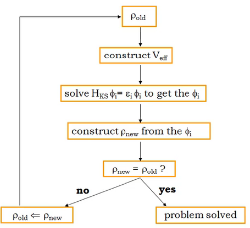

## Ab Initio Model
"Ab Initio model" , or "first principle model", where the starting point of the model cannot be further reduced.
If we start from the Schro, to what extend can we reproduce a physical, observable phenomena.

### Formal Systems
Four ingredients: Symbols, Statements(string of symbols: meaningful or meaningless; meaningful: true or false), Derivation rules(convert meaningful statements between each other), Axioms.  
- Symbols: +, =, 1, 2, 3...
- statements: 2+1=3, 1+1=3....
- Derivation rules: add '1' before or after +, and add '1' in the end
- axiom: 1+1=2

Classification of branches of Science 
- Math: search for formal systems with nice properties
- Physics: search for formal system that mimic the behavior of Nature
- Engineering: use the formal system of physics to develop devices

A tree with leaves, trunk, roots on Classical Mechanics:
- roots: axioms, newton's laws
- trunk: derivation rules, calculus
- leaves:statements about observable facts, all mechanical observation

Newtonian mechanics is an ab initio classical mechanics, where we started from the most basic laws. Choice of formal systems is not unique, for example, Langragian Mechanics. Also, not all mechanics are ab initio from newton's law, i.e. friction between surfaces.

### Solid as quantum system
Solid? mine: where constituent particled are bond together with little room for travel or exchange places.

1. A solid is a system of positive nuclei and negative electrons, all electromagnetically interacting with each other, and obeying the equations of motion prescribed by quantum physics. (electrons and nuclei, not atoms)

Properties of a materials = crystal structure + microstructure
microstructure: type/number of defects, grain size, grain orientation.

### Problem Statement
- axioms known, equations soluble
    - classical mechanics, electromagnetism, thermodynamics
    - engineering approach possible
- axioms known, equations cannot to be solved
    - condensed matter physics, material science, chemistry
-  axioms unknown
    - nuclear physics

However, quantum physics are becoming more and more computable. The formal system of Newtonian Mechanics are much more soluble than the formal system of Quantum Mechanics.

## DFT
Many-body Schroginder equations are transformed to SIngle particle Kohn-SHam equations through density functional theory.
What is the catch in the theory? DFT is an exact solution, provided that we know the exchange correlation functional. DFT says it exists, but says nothing about its appearance.

### Functions and Functionals
- Functions: `f: R -> R: x -> f(x)`, maps numbers onto (complex) numbers
- Functionals: `F: ff -> C:f->F[ff]`, maps functions onto (complex) numbers;


### the Schrodinger Equation
Wavefunction is a function
```
\psi: ? -> ?:?->\psi(?)
```
Wavefunctions for electron systems are antisymmetric for particle exchange -- an axiom of quantum physics.
The energy of the solid in Schro can be found -- energy it takes to separate electrons and necleuis to infintie distances from its original ground state.

### Born-Oppenheimer Approximation 
1. exact Hamiltonians
2. Born-Oppenheimer
3. Hartree-Fock or DFT
4. solution techniques
5. Predictions

Born-Oppenheimer approximation, a.k.a. the adiabatic principle. In classical picture, a much more massive object will move so slowly that they are at rest compare to their lighter counterparts, i.e. electrons. It reduces the number of variables.


### Slater Determinant
Maybe a many body wavefunction is the product of two independent wavefunctions? However, interchanging the two particles would introduce a negative sign.


The below incorporates the antisymmetry.


You can rewrite it in determinant form, Slater determinant, and generalize it.


### (post-)Hartree-Fock methods
HF methods search for solutions for Schro. However, we can search only in the subset of all antisymmetric wavefunction. The subset of Slater determinants within the all antisymmetric wavefunctions is then chosen. There is no garuantee our solution would be a Slater determinants. HF methods search for Slater determinants with the lowest energy, and call it the best approximation to the true ground state.

Post-HF methods sample the rest of the antisymmetric functions and try to bridge the gap between HF ground state and the exact ground state solution.

### External Potential - DFT
What to specify in a system:
- Number of electrons
- position and number of nucleui 
The electron-nucleius interaction term (the last in H) gives the energy of N electrons in the electric potential provided by a given set of nuclei at R_A. The aforemention "external potential" determins the type of system you are studying. It is "external" to the electron system.


### Electron Density - DFT
Electron density is a function.


### 1st Hohenberg-Kohn Theorem

the \psi is not all wavefunction; the density is not density.

C: External Potential -> Wavefunctions

D: Wavefunction -> Density

By construction, the relationships are surjective. There is at least one incoming arrow. But are these relationships injective, where at most one arrow arrives at a point? All information must be in wavefunctions. If two systems have the same wavefunctions, then they must be the same system, therefore C must be injective. D may not be injective, because different complex wavefunction could be projected onto the same less complex density. However, 1st HKT shows that the relationship D is injective.

To sum up, C and D are bijective -- a one-to-one relationship. You can do quantum mechanics with densities instead of wave functions.
```
There is a one-to-one correspondence between the ground state density of a many-electron system and the external potential.
```
Consequence : any observable ground state property of the many-electron system can be written as a unique functional of density:


### 2nd Hohenberg-Kohn Theorem
```
The unique functional that treturns the ground state total energy, when applied to the ground state density, returns a higher energy for any other density.
```


### Method of Kohn & Sham
The Kohn-Sham equations are an exact transformation of the original problem (coupled differential equations) in single particle equations (uncoupled).


The exchange correlation potential is a functional derivative of an exchange correlation functional. "The KS equations recast the SE problem of interacting electrons moving in an external ion potential into a problem of noninteracting electrons moving in an effective potential."

### Exchange-Correlation Functional
One unique expression for V_xc[tho] must exist, but is unknown. Begin with a simple solid with homogeneous positively charge (no nuclei), add the same amount of electrons to such solid, and the solid is now neutral. This is the simplest solid you can conjure up. To apply the idea to actual solids, divide then up into infinitely small blocks and add up the contribution from every point.

As an extension, you can use Generalized Gradient Approximation(GGA), not just local density but its surroundings. It helps improve some DFT calculations.

### Correlation
- Two body problem, analytically soluble
- Three body problem, only numerical solution possible
Energy: kinetic translationa, kinetic rotational, potential
Correlation in classical mechanics: 
`difference = (classical) correlation energy = total energy of Sun-Earth-Jupiter -(total energy of Sun-Earth+ total energy of Sun-Jupiter)`

In quantum mechanics,

Exchange: difference between Hartree and Hartree-Fock; correlation: difference between Hartree-Fock and exact solution.

### Numerical Solution Techniques
It can be solved such as a fourier series. We find a basis function upon which we solve for coefficients and improve accuracies with more terms.

A basis set transforms Kohn-ShSam equation into matrix algebra.

The self-consistent field problem. The Hartree term contains the density. The scf method is the way around.


Many choices of basis exists:
- localized basis functions: GTO, STO
- plane-wave basis function (in combination with pseudopotentials)
- augmented plane wave basis functions (LAPW, LMTO, ...)

#### All-electron methods vs. Pseudopotential methods
- Lemma 1: decomposition of a function in a sum over basis function: the larger the qualitative difference between original and basis functions, the more basis functions will you need
- Lemma 2: the time required to perform a DFT calculation increases rapidly with the number of basis functions that are used
How to get the number of basis functions as small as possible? 
- All electron methods: Close to the nuclei, the wavefunction may have high frequency, and low frequency far away from it.limit the number of basis function by selecting basis functions that look similarly to how the result will look; examples: LAPW, APW+lo, LMTO, (some) local orbitals
- Pseudopotential: when the interaction is on a relatively long range, for example chemical bonds, replace the actual potential with pseudopotential. Limit the number of basis functions by solving a hypothetical crystal that looks like the original one only in interesting regions; examples: plane waves, PAW, some local orbitals


### Basis Set Size
In a dft paper, the basis set size is usually the "kinetic energy cutoff." The stop point of the summation determines the precision of the dft calculation.

### K-Mesh/BRILLOUIN Zone Sampling
People examine properties through reciprocal space. K-points specify mesh in a 3d space to calculate numerical integrals in the first brillouin zone. A larger number suggests a finer grid with heavier calculation time.


## Crystallography
### CIF files
DFT Inputs:
- Physical input: unit cell of the crystal
- technical input: XC-functional, basis set size, k-mesh

Crystallogrpahic Information File(CIF) is human- and machine-readable.

- COD: www.crystallography.net
- ICSD: hettps://icsd.fiz-karlsruhe.de
- MP: www.materialsproject.org

